# CRMpro - AI-Powered CSV CRM Importer

An enterprise-grade, high-performance CSV data importer. It accepts customer CSV files of any arbitrary schema, intelligently maps columns using LLM/Heuristic hybrid pipelines, and normalizes records into the strict GrowEasy CRM target schema.

The application leverages Next.js on the frontend, Express & TypeScript on the backend, and streams chunk-by-chunk processing status over Server-Sent Events (SSE).

---

## Core Pipeline Architecture

```
                                  +-----------------------+
                                  |   Next.js Client UI   |
                                  +-----------+-----------+
                                              |
                                              | Uploads CSV & Opens SSE Stream
                                              v
                                  +-----------+-----------+
                                  |  Express Backend API  |
                                  +-----------+-----------+
                                              |
             +---------------------+----------+----------+---------------------+
             |                     |                     |                     |
             v                     v                     v                     v
     +-------+-------+     +-------+-------+     +-------+-------+     +-------+-------+
     |  Local Parsing|     | Heuristics    |     | SHA-256 Batch |     | Multi-LLM     |
     |  & Previewing |     | Matcher       |     | Cache Check   |     | Failover      |
     +---------------+     +---------------+     +---------------+     +---------------+
```

---

## User Interface & Import Walkthrough

### Step 1: File Upload & Drag-and-Drop
The user interface starts with a clean, modern landing page supporting drag-and-drop CSV uploads.

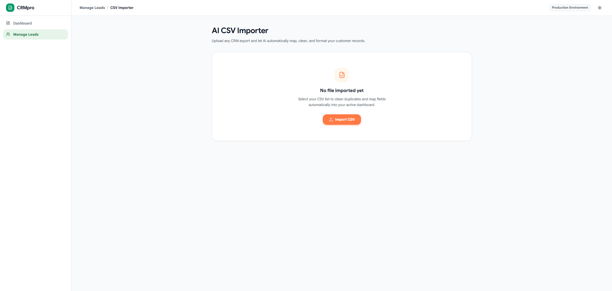
*Figure 1: CRMpro landing page showcasing the simple, modern upload interface.*

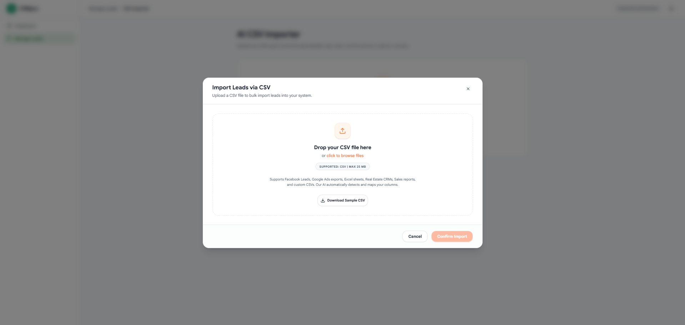
*Figure 2: Interactive drag-and-drop zone with type restrictions and file validation.*

### Step 2: Local Parsing & Preview
Once a file is uploaded, the app parses it locally to show a virtualized preview table before any AI matching or backend requests are initiated.

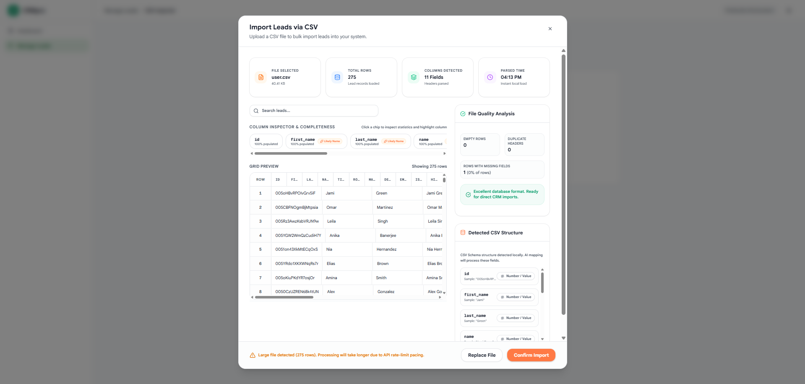
*Figure 3: Fully responsive, scrollable preview table showing raw CSV data with sticky headers.*

### Step 3: Batch Processing & SSE Streaming
During backend import execution, the progress is streamed live to the UI using Server-Sent Events (SSE).

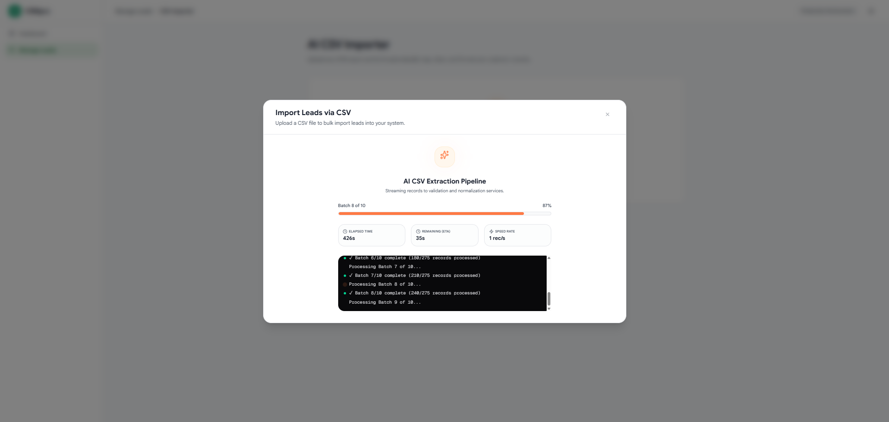
*Figure 4: Live streaming progress of the AI import pipeline, displaying real-time processing stats.*

### Step 4: Column Mapping & Cross-Verification
After AI processing, the suggested column mappings are displayed. Users can review and cross-verify the mappings to ensure the AI aligned fields correctly.

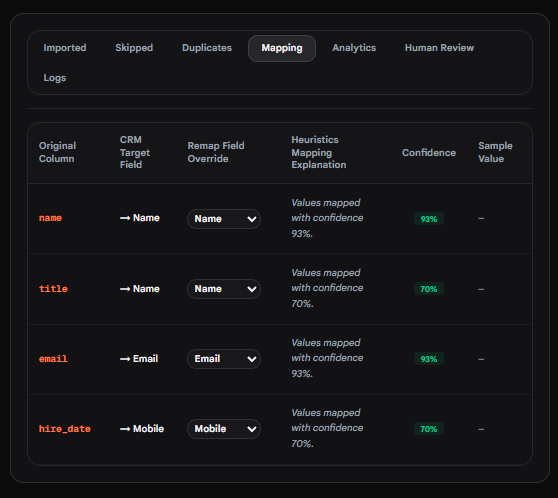
*Figure 5: Interface to review, customize, and cross-verify column mappings.*

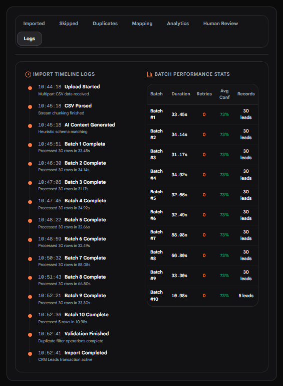
*Figure 6: Real-time logs and processing status of data insertion.*

### Step 5: Import Results & Analytics Dashboard
Upon completion, the dashboard displays imported data metrics, including analytics, skipped/duplicate rows, and cost tracking.

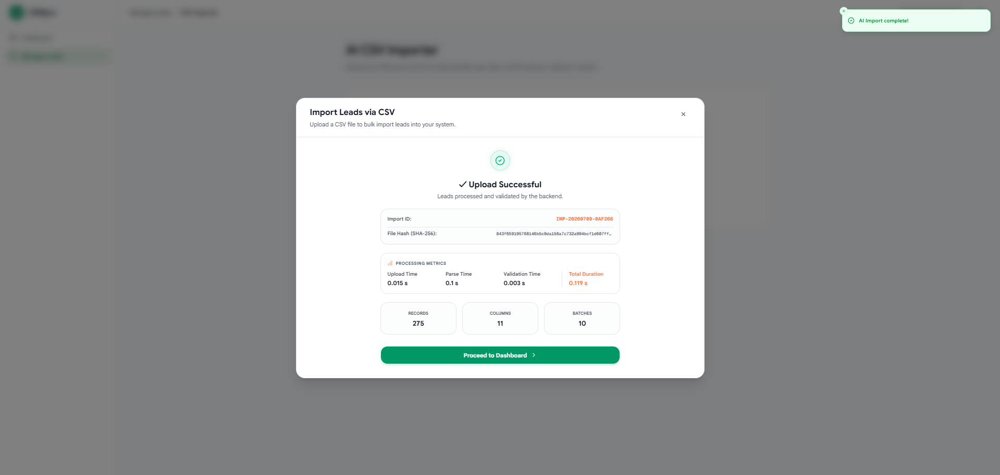
*Figure 7: Successful import confirmation page showing final summary metrics.*

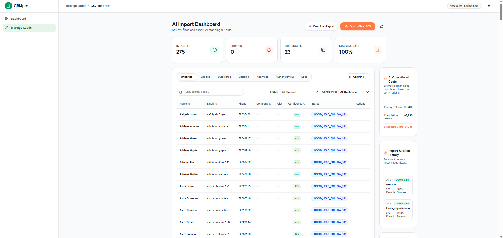
*Figure 8: Main analytics dashboard displaying import status overview, token costs, and processing stats.*

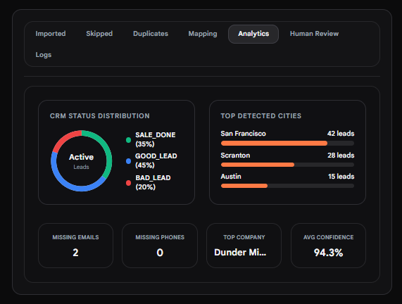
*Figure 9: Lead analytics charts showing distribution, data sources, and leads breakdown.*

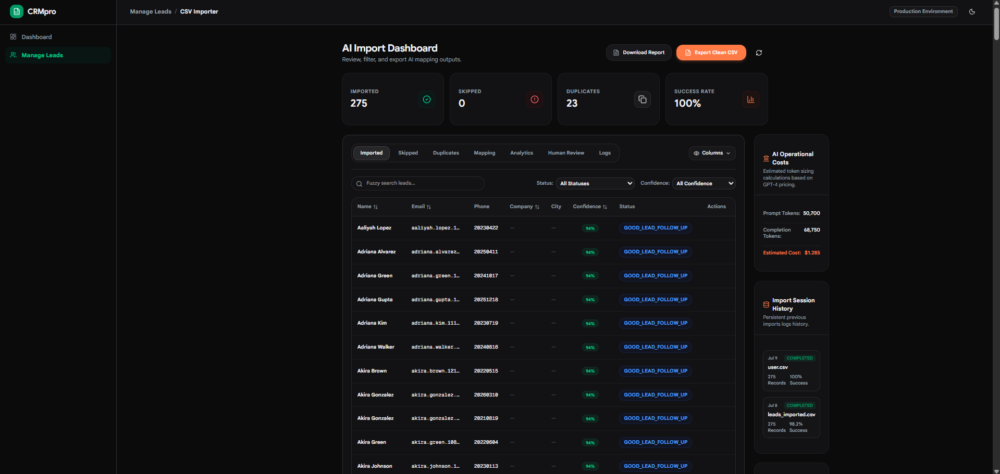
*Figure 10: Seamless dark-mode design system active across the dashboard and all views.*

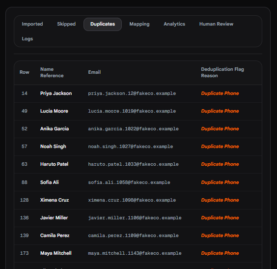
*Figure 11: Dedicated view showcasing skipped duplicate records.*

---

Apart from the primary steps, the application also contains a **Human Review section** for low-confidence mappings and a **Skipped Rows section** for records failing formatting requirements.

We used the Kaggle Sample Sales CRM Data for this Assignment: [Kaggle Sample Sales CRM dataset](https://www.kaggle.com/datasets/sushicatsan/sample-sales-crm-data?resource=download)

---

## GrowEasy Assignment Requirements Alignment

| Requirement Segment | Target Spec / Rule | Status | Implementation Details |
| :--- | :--- | :--- | :--- |
| **Frontend - Step 1** | Upload CSV via Drag & Drop or File Picker | **Met** | Drag & Drop zone with type restrictions and file size validation. |
| **Frontend - Step 2** | Local Preview (No AI) | **Met** | Fully responsive, scrollable virtualized table showing raw data with sticky headers. |
| **Frontend - Step 3** | Confirm Import | **Met** | Explicit user confirmation triggers the backend processing. |
| **Frontend - Step 4** | Display AI Results | **Met** | Complete results dashboard detailing imported, skipped, and duplicate counts. |
| **Backend API** | Upload, Parse, Batch & Send to LLM | **Met** | Express router parses multi-part requests, splits rows into batches, and streams results. |
| **CRM Schema Rules** | Status Constraint Enums | **Met** | Strictly normalizes status to `GOOD_LEAD_FOLLOW_UP`, `DID_NOT_CONNECT`, `BAD_LEAD`, or `SALE_DONE`. |
| **CRM Schema Rules** | Allowed Data Sources | **Met** | Limits values to `leads_on_demand`, `meridian_tower`, `eden_park`, `varah_swamy`, `sarjapur_plots`. |
| **CRM Schema Rules** | Date Normalization | **Met** | Converts dates to ISO-8601 strings compatible with `new Date(created_at)`. |
| **CRM Schema Rules** | Multiple Emails/Phones | **Met** | Selects the first value; appends the rest to `crm_note`. |
| **CRM Schema Rules** | Skip Invalid Records | **Partially Met** | Strips invalid rows on bad names/emails. *Detail below.* |

---

## What Extra We Have Done (Beyond Core Scope)

To make the application production-ready, we implemented several features that go far beyond a basic MVP:

1. **Heuristic Pre-Analysis & Column Similarity Mapping (`csvAnalyzer.ts`)**
   - Before calling the LLM, the backend analyzes column density, completeness, and regex-matches content types (e.g., detecting if a column looks like email, phone, or name formats).
   - This metadata is injected into the LLM prompt, decreasing hallucinations and boosting mapping accuracy.

2. **Resilient Multi-Provider LLM Failover Pipeline**
   - To guard against API downtime, if the primary LLM (Gemini 2.5 Flash) times out or errors, the system automatically redirects the batch request to OpenAI (GPT-4o/equivalent) fallback endpoints seamlessly.

3. **Deterministic Local Fallback Simulation**
   - If no API keys are provided in `.env`, the system degrades gracefully to a local rule-based heuristic matcher rather than crashing, letting users test the app offline.

4. **SHA-256 Batch Response Caching**
   - Hashes batch data chunks. If a batch contains identical rows to a previously imported batch, it bypasses the LLM call entirely, serving the mapping from the cache to cut down token latency and API cost.

5. **Token Cost & Usage Tracking**
   - Tracks actual input/output token usage per batch and reports estimated execution costs directly to the results dashboard interface.

6. **Interactive Auditing and Human Review Queue**
   - Displays fields with lower confidence scores (e.g. below 70%) in an audit sidebar, allowing users to make manual edits and corrections in-browser before concluding.

7. **On-the-Fly Re-Mapping Overrides**
   - If the AI makes a mapping mistake, users can manually re-map columns in the dashboard UI and instantly recalculate the fields.

8. **Docker Multi-Container Orchestration**
   - Docker Compose file configured to start the frontend client and backend API as isolated, networked services with a single command.

---

## Deviations, Known Gaps & Design Decisions

### 1. Missing "No Email AND No Mobile" Exclusion Rule
* **Context Requirement**: *Skip any record that has no email AND no mobile number.*
* **Current State**: The backend validator (`validation.service.ts`) checks for required names, cleans invalid email patterns, and normalizes phone digits. However, **it does not explicitly drop rows that lack both email and phone numbers**. Instead, it passes them through as partial records or issues warnings.
* **Why it was missed/handled this way**: The LLM prompt was instructed to map fields and output empty strings for missing items. During validation processing, the filter logic failed to reject rows where *both* parameters normalized to empty strings. This is a known gap in `validation.service.ts` that can be resolved by adding a simple check:
  ```typescript
  if (!email && !mobileDigits) {
    errors.push("Record skipped: must contain at least an email or a mobile number.");
  }
  ```

### 2. Hybrid Normalization (Deterministic + AI-Driven)
* **Design Decision**: Instead of relying 100% on the LLM to format dates and handle status strings (which is prone to hallucinations or format deviations), the system is built as a **hybrid processor**. 
  - The AI suggests matching categories and extracts the text.
  - A deterministic TS validation layer (`NormalizationService`) sanitizes the date parseability, parses complex telephone prefixes, and enforces exact enum capitalization rules.
  - This separation of concerns ensures that the data imported is structurally bulletproof.

---

## Tech Stack & Project Directory Structure

- **Frontend**: Next.js 15 (App Router), TypeScript, Tailwind CSS, Framer Motion, Lucide icons.
- **Backend**: Express, TypeScript, Winston JSON logging, Multer file receiver, Jest testing framework.
- **DevOps**: Docker, docker-compose configuration.

```
CRMpro/
├── app/                       # Next.js Page components & main dashboard route
├── components/                # Modular UI widgets (preview table, results, sidebar)
├── backend/
│   ├── src/
│   │   ├── config/            # App settings & validation
│   │   ├── controllers/       # HTTP Request routers
│   │   ├── middleware/        # Rate limits & safety checks
│   │   ├── routes/            # Route endpoints
│   │   ├── services/          # CSV parsing, AI matching, & normalizations
│   │   └── utils/             # Heuristic math and formatting helpers
│   ├── jest.config.js         # Backend test configuration
│   └── Dockerfile             # Production multi-stage Dockerfile
├── Dockerfile                 # Frontend multi-stage Dockerfile
└── docker-compose.yml         # Container configuration file
```

---

## Quickstart, Installation & Deployment

### Live Backend Deployment
The backend API is deployed and running live on Render.

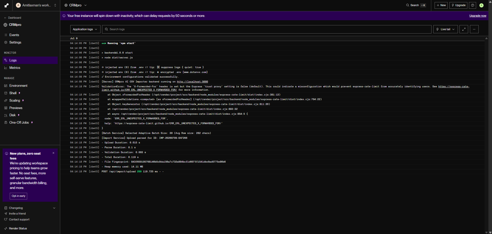
*Figure 12: CRMpro Express backend API running live on Render.*

### Local Manual Installation

1. **Install Workspace Dependencies**:
   From the project root:
   ```bash
   npm install
   ```

2. **Configure Environment Variables**:
   Create a `.env` file in the `backend/` directory:
   ```env
   PORT=5000
   MAX_FILE_SIZE=26214400
   MAX_BATCH_SIZE=25
   NODE_ENV=development
   GEMINI_API_KEY=your_gemini_api_key
   OPENAI_API_KEY=your_openai_api_key
   ```

3. **Start the API Server**:
   ```bash
   cd backend
   npm run dev
   ```

4. **Start the Next.js Client**:
   Open a separate shell from the project root:
   ```bash
   npm run dev
   ```
   Access the dashboard at `http://localhost:3000`.

### Docker Compose Setup (Recommended)

Start the entire stack (Next.js + Node/Express) inside Docker:
```bash
docker-compose up --build
```
- Client runs on `http://localhost:3000`
- API runs on `http://localhost:5000`

### Running Unit Tests

Run Jest testing suites inside the backend workspace to verify mapping normalizations:
```bash
cd backend
npm test
```

